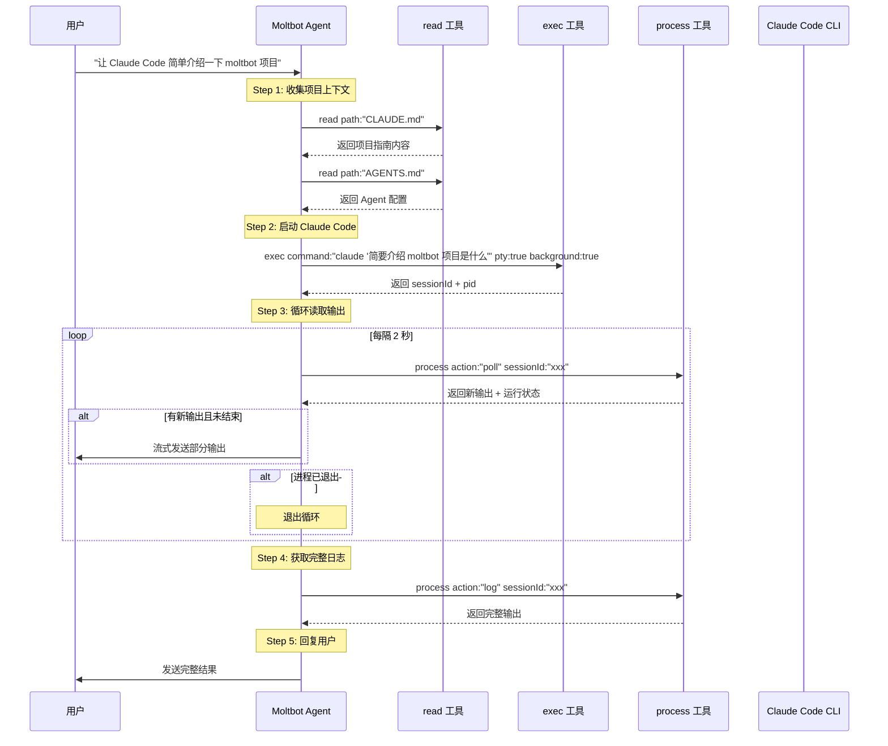

# Moltbot 核心工具详解：协调 Claude Code 完成任务

## 概述

本文档详细介绍 Moltbot 的核心工具如何配合使用，以实现"让 Claude Code 介绍 Moltbot 项目"这一典型场景。

---

## 典型场景：让 Claude Code 介绍 Moltbot 项目

### 用户请求

```
用户: "让 Claude Code 简单介绍一下 moltbot 项目"
```

### Moltbot Agent 执行流程



### 详细步骤分解

```typescript
// Step 1: 了解项目上下文
const claudeMd = await callTool("read", { path: "CLAUDE.md" });
const agentsMd = await callTool("read", { path: "AGENTS.md" });

// Step 2: 启动 Claude Code（后台 + PTY 模式）
const execResult = await callTool("exec", {
  command: "claude '简要介绍 moltbot 项目是什么'",
  pty: true,           // 启用伪终端（Claude Code 需要 TTY）
  background: true,    // 后台运行
  yieldMs: 2000        // 前 2 秒实时输出
});

const sessionId = execResult.details.sessionId;
const pid = execResult.pid;

// Step 3: 循环轮询输出
let running = true;
let fullOutput = "";

while (running) {
  await sleep(2000);  // 等待 2 秒

  const pollResult = await callTool("process", {
    action: "poll",
    sessionId: sessionId
  });

  // 获取新输出
  const newOutput = pollResult.content[0].text;
  fullOutput += newOutput;

  // 流式发送给用户
  if (newOutput && newOutput !== "(no new output)") {
    await streamToUser(newOutput);
  }

  // 检查是否结束
  if (pollResult.details.status === "completed" ||
      pollResult.details.status === "failed") {
    running = false;
  }
}

// Step 4: 获取完整日志（可选，用于验证）
const logResult = await callTool("process", {
  action: "log",
  sessionId: sessionId
});

// Step 5: 发送最终结果给用户
await sendMessage({
  channel: "telegram",
  target: "@user",
  message: `Claude Code 的回答：\n\n${fullOutput}`
});
```

---

## 核心工具详解

### 1. `read` 工具

#### 功能
从文件系统读取文件内容（来自 Pi Coding Agent）。

#### 参数

| 参数 | 类型 | 必需 | 说明 | 示例 |
|------|------|------|------|------|
| `path` | string | ✅ | 文件路径（相对或绝对） | `"CLAUDE.md"` |
| `start` | number | ❌ | 起始行号（从 0 开始） | `0` |
| `end` | number | ❌ | 结束行号（不含） | `100` |

#### 返回值

```typescript
{
  content: [
    {
      type: "text",
      text: "文件内容..."
    }
  ],
  details: {
    path: "CLAUDE.md",
    lines: 150,
    bytes: 12345
  }
}
```

#### 示例

```typescript
// 读取完整文件
await callTool("read", {
  path: "CLAUDE.md"
});

// 读取前 50 行
await callTool("read", {
  path: "README.md",
  start: 0,
  end: 50
});

// 读取第 100-200 行
await callTool("read", {
  path: "src/agents/bash-tools.exec.ts",
  start: 100,
  end: 200
});
```

---

### 2. `exec` 工具

#### 功能
执行 Shell 命令，支持后台运行、PTY 模式、多环境执行。

#### 参数

| 参数 | 类型 | 必需 | 说明 | 默认值 |
|------|------|------|------|--------|
| `command` | string | ✅ | Shell 命令 | - |
| `pty` | boolean | ❌ | 启用伪终端（交互式 CLI） | `false` |
| `background` | boolean | ❌ | 后台运行 | `false` |
| `yieldMs` | number | ❌ | 后台前等待时间（毫秒） | `5000` |
| `timeout` | number | ❌ | 超时时间（毫秒） | `120000` |
| `workdir` | string | ❌ | 工作目录 | 当前目录 |
| `env` | Record<string, string> | ❌ | 环境变量覆盖 | `{}` |
| `host` | string | ❌ | 执行环境（`host`/`sandbox`/`remote`） | `host` |
| `elevated` | boolean | ❌ | 是否需要提升权限（sudo） | `false` |

#### 返回值

**前台执行完成**：
```typescript
{
  content: [
    {
      type: "text",
      text: "stdout 输出..."
    }
  ],
  details: {
    pid: 12345,
    exitCode: 0,
    stdout: "...",
    stderr: "...",
    truncated: false,
    backgrounded: false
  }
}
```

**后台执行（转入后台）**：
```typescript
{
  content: [
    {
      type: "text",
      text: "前 yieldMs 毫秒的输出..."
    }
  ],
  details: {
    sessionId: "abc123def456",  // ⚠️ 重要：用于后续 process 工具操作
    pid: 12345,
    backgrounded: true
  }
}
```

#### 示例

**简单命令**：
```typescript
await callTool("exec", {
  command: "git status --short"
});
```

**后台执行**：
```typescript
const result = await callTool("exec", {
  command: "npm run dev",
  background: true,
  yieldMs: 3000  // 前 3 秒输出立即返回
});

const sessionId = result.details.sessionId;
// 使用 sessionId 通过 process 工具管理
```

**交互式 CLI（PTY 模式）**：
```typescript
await callTool("exec", {
  command: "claude '介绍 moltbot 项目'",
  pty: true,           // 必须启用 PTY
  background: true
});
```

**指定工作目录和环境变量**：
```typescript
await callTool("exec", {
  command: "npm test",
  workdir: "./packages/core",
  env: {
    NODE_ENV: "test",
    CI: "true"
  }
});
```

**沙箱执行**：
```typescript
await callTool("exec", {
  command: "rm -rf /tmp/test",
  host: "sandbox"  // 在 Docker 容器中执行
});
```

---

### 3. `process` 工具

#### 功能
管理后台进程（由 `exec` 工具启动），支持查看输出、发送输入、终止进程。

#### Actions（子命令）

##### 3.1 `list` - 列出所有进程

**参数**：
```typescript
{
  action: "list"
}
```

**返回值**：
```typescript
{
  content: [
    {
      type: "text",
      text: "abc123 running   5.2s :: npm run dev\ndef456 completed 12.5s :: git pull"
    }
  ],
  details: {
    sessions: [
      {
        sessionId: "abc123",
        status: "running",
        pid: 12345,
        startedAt: 1706789012345,
        runtimeMs: 5200,
        command: "npm run dev",
        name: "npm run dev"
      },
      // ...
    ]
  }
}
```

##### 3.2 `poll` - 轮询进程状态和新输出

**参数**：
```typescript
{
  action: "poll",
  sessionId: "abc123"
}
```

**返回值**：

**进程运行中**：
```typescript
{
  content: [
    {
      type: "text",
      text: "新输出内容...\n\nProcess still running."
    }
  ],
  details: {
    status: "running",
    sessionId: "abc123",
    aggregated: false  // 是否已聚合全部输出
  }
}
```

**进程已退出**：
```typescript
{
  content: [
    {
      type: "text",
      text: "最后的输出...\n\nProcess exited with code 0."
    }
  ],
  details: {
    status: "completed",  // 或 "failed"
    sessionId: "abc123",
    exitCode: 0
  }
}
```

**说明**：
- `poll` 会 **消费**输出缓冲区，每次返回自上次调用以来的新输出
- 适合循环调用，实现流式输出效果
- 如果没有新输出，返回 `"(no new output)"`

##### 3.3 `log` - 获取完整日志

**参数**：
```typescript
{
  action: "log",
  sessionId: "abc123",
  offset?: number,  // 起始行偏移
  limit?: number    // 返回行数
}
```

**返回值**：
```typescript
{
  content: [
    {
      type: "text",
      text: "完整的 stdout + stderr 输出..."
    }
  ],
  details: {
    status: "running" | "completed" | "failed",
    lines: 150,
    truncated: false
  }
}
```

**说明**：
- `log` **不消费**输出缓冲区，可以多次读取
- 适合查看完整日志或特定范围的输出

##### 3.4 `write` - 向进程 stdin 写入数据

**参数**：
```typescript
{
  action: "write",
  sessionId: "abc123",
  data: "yes\n",     // 要发送的数据
  eof?: boolean      // 是否关闭 stdin（可选）
}
```

**返回值**：
```typescript
{
  content: [
    {
      type: "text",
      text: "Data written to stdin."
    }
  ],
  details: {
    status: "ok",
    bytesWritten: 4
  }
}
```

**示例**：
```typescript
// 向交互式进程发送输入
await callTool("process", {
  action: "write",
  sessionId: "abc123",
  data: "2\n"  // 选择选项 2 并按回车
});
```

##### 3.5 `send-keys` - 发送特殊按键（PTY 模式）

**参数**：
```typescript
{
  action: "send-keys",
  sessionId: "abc123",
  keys: ["Up", "Enter"],     // 键名数组
  hex?: ["0x1b", "0x5b"],    // 或十六进制字节
  literal?: "Hello"          // 或字面字符串
}
```

**支持的键名**：
- `Enter`, `Escape`, `Tab`, `Backspace`, `Delete`
- `Up`, `Down`, `Left`, `Right`
- `Home`, `End`, `PageUp`, `PageDown`
- `F1`-`F12`
- `Ctrl-C`, `Ctrl-D`, `Ctrl-Z` 等

**示例**：
```typescript
// 发送 Ctrl-C 终止命令
await callTool("process", {
  action: "send-keys",
  sessionId: "abc123",
  keys: ["Ctrl-C"]
});

// 导航菜单并选择
await callTool("process", {
  action: "send-keys",
  sessionId: "abc123",
  keys: ["Down", "Down", "Enter"]
});
```

##### 3.6 `paste` - 粘贴文本（PTY 模式）

**参数**：
```typescript
{
  action: "paste",
  sessionId: "abc123",
  text: "长文本内容...",
  bracketed?: boolean  // 是否使用 bracketed paste mode
}
```

**说明**：
- 适合粘贴多行文本或代码
- `bracketed: true` 会在文本前后发送特殊转义序列，防止自动缩进等问题

##### 3.7 `kill` - 终止进程

**参数**：
```typescript
{
  action: "kill",
  sessionId: "abc123"
}
```

**返回值**：
```typescript
{
  content: [
    {
      type: "text",
      text: "Process killed."
    }
  ],
  details: {
    status: "killed",
    signal: "SIGTERM"
  }
}
```

##### 3.8 `remove` - 删除已结束的进程记录

**参数**：
```typescript
{
  action: "remove",
  sessionId: "abc123"
}
```

---

### 4. `message` 工具

#### 功能
向消息渠道（Telegram/Discord/Slack 等）发送消息或执行渠道操作。

#### 参数

| 参数 | 类型 | 必需 | 说明 | 示例 |
|------|------|------|------|------|
| `action` | string | ❌ | 操作类型（默认 `"send"`） | `"send"`, `"react"`, `"delete"` |
| `channel` | string | ❌ | 渠道名称 | `"telegram"`, `"discord"` |
| `target` | string | ❌ | 目标（用户/群组/频道） | `"@username"`, `"-1001234567890"` |
| `message` | string | ❌ | 消息文本 | `"Hello, world!"` |
| `media` | string | ❌ | 媒体文件路径 | `"/tmp/image.png"` |
| `replyTo` | string | ❌ | 回复的消息 ID | `"12345"` |
| `silent` | boolean | ❌ | 是否静默发送（无通知） | `false` |
| `dryRun` | boolean | ❌ | 仅测试，不实际发送 | `false` |

#### 返回值

```typescript
{
  content: [
    {
      type: "text",
      text: "Message sent successfully."
    }
  ],
  details: {
    messageId: "12345",
    channel: "telegram",
    target: "@user"
  }
}
```

#### 示例

**发送文本消息**：
```typescript
await callTool("message", {
  action: "send",
  channel: "telegram",
  target: "@user",
  message: "Claude Code 的回答：\n\nMoltbot 是一个..."
});
```

**发送带图片的消息**：
```typescript
await callTool("message", {
  action: "send",
  channel: "telegram",
  target: "@user",
  message: "截图如下：",
  media: "/tmp/screenshot.png"
});
```

**回复特定消息**：
```typescript
await callTool("message", {
  action: "send",
  channel: "telegram",
  target: "@user",
  message: "回复内容",
  replyTo: "12345"
});
```

**添加表情反应**：
```typescript
await callTool("message", {
  action: "react",
  channel: "telegram",
  target: "@user",
  messageId: "12345",
  emoji: "👍"
});
```

**删除消息**：
```typescript
await callTool("message", {
  action: "delete",
  channel: "telegram",
  target: "@user",
  messageId: "12345"
});
```

---

## 完整示例代码

### 场景：让 Claude Code 介绍 Moltbot 项目

```typescript
/**
 * Moltbot Agent 处理用户请求：
 * "让 Claude Code 简单介绍一下 moltbot 项目"
 */

async function handleClaudeCodeIntroduction(context: AgentContext) {
  const { callTool, streamMessage, sendMessage } = context;

  // Step 1: 读取项目上下文
  console.log("📖 正在读取项目文档...");

  const claudeMd = await callTool("read", {
    path: "CLAUDE.md"
  });

  const readme = await callTool("read", {
    path: "README.md",
    start: 0,
    end: 100  // 仅读取前 100 行
  });

  // Step 2: 启动 Claude Code
  console.log("🚀 启动 Claude Code...");

  const execResult = await callTool("exec", {
    command: `claude '基于以下项目信息，简要介绍 Moltbot 项目是什么：

项目指南：${claudeMd.content[0].text.slice(0, 1000)}

README：${readme.content[0].text.slice(0, 500)}
'`,
    pty: true,           // Claude Code 需要 TTY
    background: true,    // 后台运行
    yieldMs: 2000,       // 前 2 秒实时输出
    timeout: 60000       // 60 秒超时
  });

  const sessionId = execResult.details.sessionId;
  const pid = execResult.pid;

  console.log(`✅ Claude Code 已启动（PID: ${pid}, Session: ${sessionId}）`);

  // 发送初始输出给用户
  if (execResult.content[0].text) {
    await streamMessage(execResult.content[0].text);
  }

  // Step 3: 循环轮询输出
  console.log("📡 开始轮询输出...");

  let running = true;
  let pollCount = 0;
  const maxPolls = 30;  // 最多轮询 30 次（60 秒）

  while (running && pollCount < maxPolls) {
    pollCount++;

    // 等待 2 秒
    await sleep(2000);

    // 轮询进程状态和新输出
    const pollResult = await callTool("process", {
      action: "poll",
      sessionId: sessionId
    });

    const status = pollResult.details.status;
    const newOutput = pollResult.content[0].text;

    console.log(`[轮询 ${pollCount}] 状态: ${status}`);

    // 如果有新输出，流式发送给用户
    if (newOutput && !newOutput.includes("(no new output)")) {
      console.log(`📤 发送新输出（${newOutput.length} 字符）`);
      await streamMessage(newOutput);
    }

    // 检查是否结束
    if (status === "completed") {
      console.log("✅ Claude Code 执行完成");
      running = false;
    } else if (status === "failed") {
      console.log("❌ Claude Code 执行失败");
      running = false;

      // 获取完整日志查看错误
      const logResult = await callTool("process", {
        action: "log",
        sessionId: sessionId
      });

      await sendMessage({
        channel: context.channel,
        target: context.user,
        message: `执行失败，完整日志：\n\n${logResult.content[0].text}`
      });

      return;
    }
  }

  // 超时处理
  if (pollCount >= maxPolls && running) {
    console.log("⏰ 轮询超时，强制终止进程");

    await callTool("process", {
      action: "kill",
      sessionId: sessionId
    });

    await sendMessage({
      channel: context.channel,
      target: context.user,
      message: "⚠️ Claude Code 执行超时，已终止进程。"
    });

    return;
  }

  // Step 4: 获取完整输出（验证）
  console.log("📋 获取完整日志...");

  const logResult = await callTool("process", {
    action: "log",
    sessionId: sessionId
  });

  const fullOutput = logResult.content[0].text;

  console.log(`✅ 完整输出：${fullOutput.length} 字符`);

  // Step 5: 发送最终消息
  await sendMessage({
    channel: context.channel,
    target: context.user,
    message: `🎉 Claude Code 介绍完成！\n\n完整输出：\n${fullOutput}`
  });

  // 清理进程记录
  await callTool("process", {
    action: "remove",
    sessionId: sessionId
  });

  console.log("🧹 已清理进程记录");
}

// 辅助函数
function sleep(ms: number): Promise<void> {
  return new Promise(resolve => setTimeout(resolve, ms));
}
```

---

## 进阶技巧

### 1. 实现进度指示器

```typescript
async function execWithProgress(command: string) {
  const execResult = await callTool("exec", {
    command,
    pty: true,
    background: true,
    yieldMs: 1000
  });

  const sessionId = execResult.details.sessionId;
  let dotCount = 0;

  while (true) {
    await sleep(1000);

    const pollResult = await callTool("process", {
      action: "poll",
      sessionId
    });

    // 显示进度点
    dotCount = (dotCount + 1) % 4;
    const dots = ".".repeat(dotCount);
    console.log(`执行中${dots}   `);

    if (pollResult.details.status !== "running") {
      break;
    }
  }
}
```

### 2. 超时重试机制

```typescript
async function execWithRetry(
  command: string,
  maxRetries: number = 3,
  timeout: number = 30000
) {
  for (let attempt = 1; attempt <= maxRetries; attempt++) {
    try {
      const result = await callTool("exec", {
        command,
        timeout,
        background: false
      });

      if (result.details.exitCode === 0) {
        return result;
      }

      console.log(`尝试 ${attempt} 失败，退出码: ${result.details.exitCode}`);
    } catch (error) {
      console.log(`尝试 ${attempt} 异常: ${error.message}`);
    }

    if (attempt < maxRetries) {
      await sleep(2000);  // 等待 2 秒后重试
    }
  }

  throw new Error(`命令执行失败，已重试 ${maxRetries} 次`);
}
```

### 3. 批量进程管理

```typescript
async function runParallelTasks(commands: string[]) {
  const sessionIds: string[] = [];

  // 启动所有任务
  for (const command of commands) {
    const result = await callTool("exec", {
      command,
      background: true,
      pty: false
    });
    sessionIds.push(result.details.sessionId);
  }

  console.log(`✅ 已启动 ${sessionIds.length} 个并行任务`);

  // 监控所有任务
  const results: Record<string, any> = {};

  while (sessionIds.length > 0) {
    await sleep(2000);

    for (let i = sessionIds.length - 1; i >= 0; i--) {
      const sessionId = sessionIds[i];

      const pollResult = await callTool("process", {
        action: "poll",
        sessionId
      });

      if (pollResult.details.status !== "running") {
        console.log(`✅ 任务 ${sessionId} 完成`);
        results[sessionId] = pollResult;
        sessionIds.splice(i, 1);
      }
    }
  }

  return results;
}
```

### 4. 交互式命令处理

```typescript
async function handleInteractiveCommand(command: string, inputs: string[]) {
  // 启动命令
  const execResult = await callTool("exec", {
    command,
    pty: true,
    background: true,
    yieldMs: 1000
  });

  const sessionId = execResult.details.sessionId;

  // 依次发送输入
  for (const input of inputs) {
    await sleep(1000);  // 等待提示符

    // 查看当前输出
    const pollResult = await callTool("process", {
      action: "poll",
      sessionId
    });

    console.log("当前输出:", pollResult.content[0].text);

    // 发送输入
    await callTool("process", {
      action: "write",
      sessionId,
      data: input + "\n"
    });
  }

  // 等待命令完成
  while (true) {
    await sleep(1000);

    const pollResult = await callTool("process", {
      action: "poll",
      sessionId
    });

    if (pollResult.details.status !== "running") {
      return pollResult;
    }
  }
}

// 使用示例
await handleInteractiveCommand(
  "npm init",
  ["my-package", "1.0.0", "My Package", "index.js", "yes"]
);
```

---

## 最佳实践

### 1. 错误处理

```typescript
try {
  const result = await callTool("exec", {
    command: "git pull",
    timeout: 30000
  });

  if (result.details.exitCode !== 0) {
    console.error("命令失败:", result.details.stderr);
    // 处理错误...
  }
} catch (error) {
  console.error("工具调用异常:", error.message);
  // 处理异常...
}
```

### 2. 输出截断处理

```typescript
const logResult = await callTool("process", {
  action: "log",
  sessionId: sessionId,
  offset: 0,
  limit: 1000  // 仅获取前 1000 行
});

if (logResult.details.truncated) {
  console.warn("输出已截断，使用 offset/limit 分页读取");
}
```

### 3. 资源清理

```typescript
try {
  // 执行任务...
  const result = await callTool("exec", {
    command: "long-running-task",
    background: true
  });

  const sessionId = result.details.sessionId;

  // ... 处理输出 ...

} finally {
  // 确保清理进程
  await callTool("process", {
    action: "kill",
    sessionId: sessionId
  });

  await callTool("process", {
    action: "remove",
    sessionId: sessionId
  });
}
```

### 4. 权限控制

配置 `exec` 工具的安全策略：

```yaml
# ~/.clawdbot/config.yaml
tools:
  exec:
    security: allowlist  # 白名单模式
    allowlist:
      - "git *"
      - "npm *"
      - "claude *"
    ask: on-miss  # 白名单未命中时询问用户
```

---

## 工具组合模式

### 模式 1: Read → Exec → Process

**用途**：读取上下文 → 执行命令 → 监控输出

```typescript
// 1. 读取配置
const config = await callTool("read", { path: "config.yaml" });

// 2. 基于配置执行命令
const result = await callTool("exec", {
  command: `deploy --config ${config.content[0].text}`,
  background: true
});

// 3. 监控部署进度
while (true) {
  const poll = await callTool("process", {
    action: "poll",
    sessionId: result.details.sessionId
  });

  if (poll.details.status !== "running") break;
  await sleep(5000);
}
```

### 模式 2: Exec → Process Write → Process Poll

**用途**：启动交互式程序 → 发送输入 → 读取输出

```typescript
// 1. 启动 REPL
const result = await callTool("exec", {
  command: "node",
  pty: true,
  background: true
});

const sessionId = result.details.sessionId;

// 2. 发送命令
await callTool("process", {
  action: "write",
  sessionId,
  data: "console.log('Hello')\n"
});

await sleep(500);

// 3. 读取输出
const poll = await callTool("process", {
  action: "poll",
  sessionId
});

console.log("REPL 输出:", poll.content[0].text);
```

### 模式 3: Exec → Process Poll → Message

**用途**：执行命令 → 轮询结果 → 通知用户

```typescript
// 1. 启动长任务
const result = await callTool("exec", {
  command: "npm run build",
  background: true
});

// 2. 轮询进度
while (true) {
  const poll = await callTool("process", {
    action: "poll",
    sessionId: result.details.sessionId
  });

  // 3. 实时通知用户
  if (poll.content[0].text && !poll.content[0].text.includes("no new output")) {
    await callTool("message", {
      channel: "telegram",
      target: "@user",
      message: `构建进度：\n${poll.content[0].text}`
    });
  }

  if (poll.details.status !== "running") break;
  await sleep(10000);
}
```

---

## 故障排查

### 问题 1: PTY 命令无输出

**原因**：某些程序检测到非 TTY 环境时不输出内容。

**解决方案**：
```typescript
await callTool("exec", {
  command: "your-command",
  pty: true,  // ✅ 必须启用 PTY
  background: true
});
```

### 问题 2: 后台进程找不到

**原因**：Session 隔离导致进程在不同作用域。

**解决方案**：
```typescript
// 查看所有进程
const list = await callTool("process", { action: "list" });
console.log(list.content[0].text);
```

### 问题 3: 输出被截断

**原因**：输出超过 `maxOutputChars` 限制。

**解决方案**：
```yaml
# ~/.clawdbot/config.yaml
tools:
  exec:
    maxOutputChars: 200000  # 增加限制
```

或使用分页读取：
```typescript
await callTool("process", {
  action: "log",
  sessionId: sessionId,
  offset: 0,
  limit: 1000
});
```

---

## 总结

通过 `read`、`exec`、`process`、`message` 四个核心工具的配合：

1. **read** - 获取上下文和配置
2. **exec** - 启动命令（支持后台 + PTY）
3. **process** - 管理后台进程（轮询、输入、输出）
4. **message** - 通知用户结果

Moltbot 可以实现：
- ✅ 协调其他 AI CLI 工具（Claude Code、Cursor AI、GitHub Copilot CLI 等）
- ✅ 实现复杂的多步骤自动化工作流
- ✅ 跨消息渠道提供统一的 AI 能力
- ✅ 安全可控的远程命令执行

这正是 Moltbot 相比 Claude Code 的核心优势：**不仅是 AI 助手，更是 AI 协调器**。
